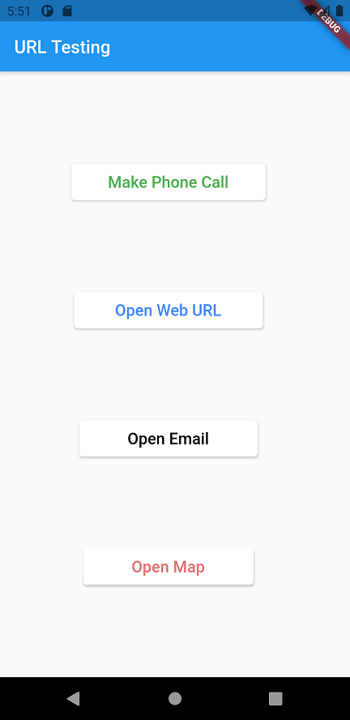
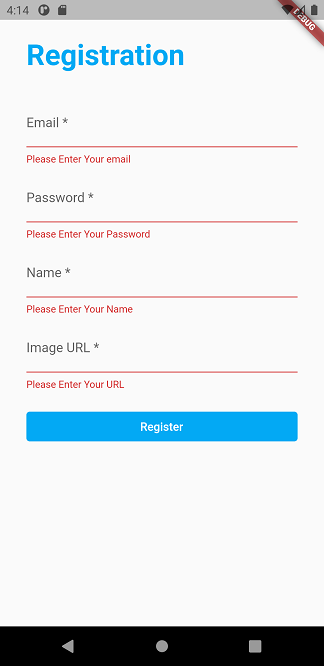
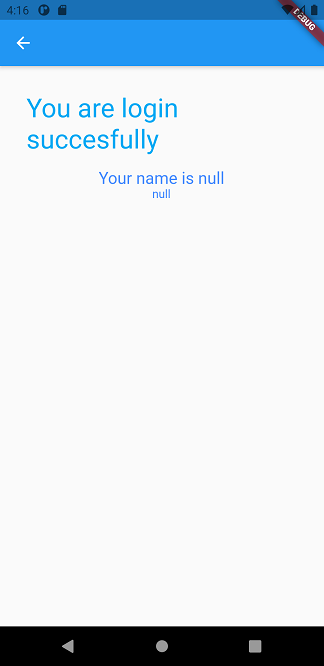

# URL Launcher Package

> Support IOS, Android and Web. Simple Code
>Value Validation

## Demo
>Registration Screen




>Registration Screen Validation




>Login Screen


>Home Screen



## Getting Started
clone this repo
```
git clone https://github.com/naumansamtia/flutter-form-auth.git flutter_form_auth
```
## Connect With Me
Nauman Samtia– [@NaumanSamtia](https://www.linkedin.com/in/naumansamtia/) – naumansamtia3@gmail.com


